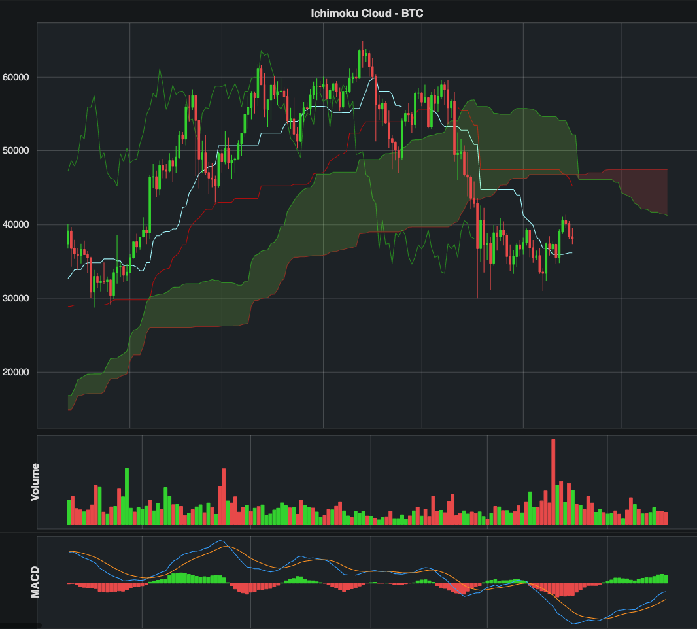

# Minimum Viable Product - State of Bitcoin

I have built a modularized pipeline that performs a wide variety of functions, separated into appropriate modules. The pipeline has separate modules that each obtain data through API's or through scraping from Glassnode, Google Trends, and Reddit. I have also built a module that obtains Bitcoin candle data through the jesse.trade API. The sentiment data (Google Trends and Reddit) will not be presented on this iteration of the dashboard, but the collection process has been built for future work.

The data is manipulated in order to calculate a variety of indicators. The time-series data for each indicator is stored in a Postgres database. Each morning, with three lines written in the terminal, I can:  (1) download all price data to the database through the jesse.trade API, (2) update all other portions of the database through a python script, and (3) display the Bokeh dashboard.

One grouping of price indicators is referred to as the Ichimoku Cloud, as shown below. Each line and area in the graph below was calculated using price data and jesse.trade built-in functions.

