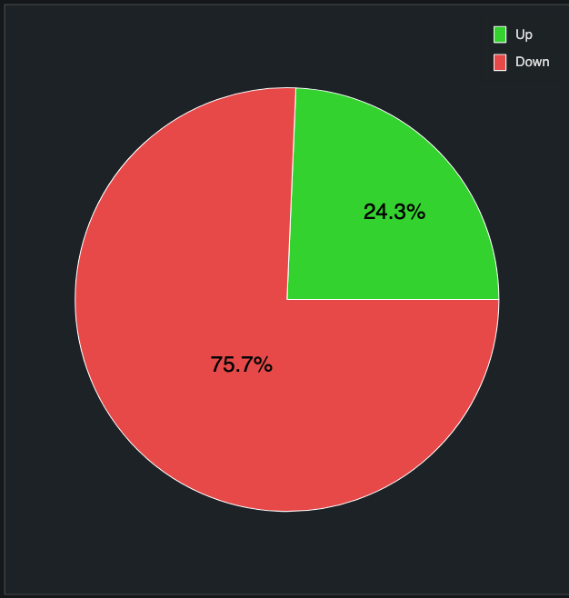
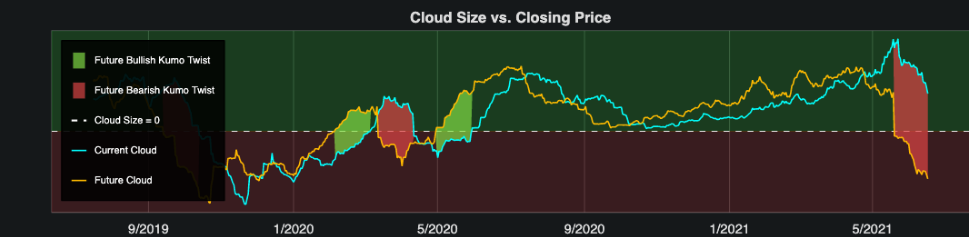
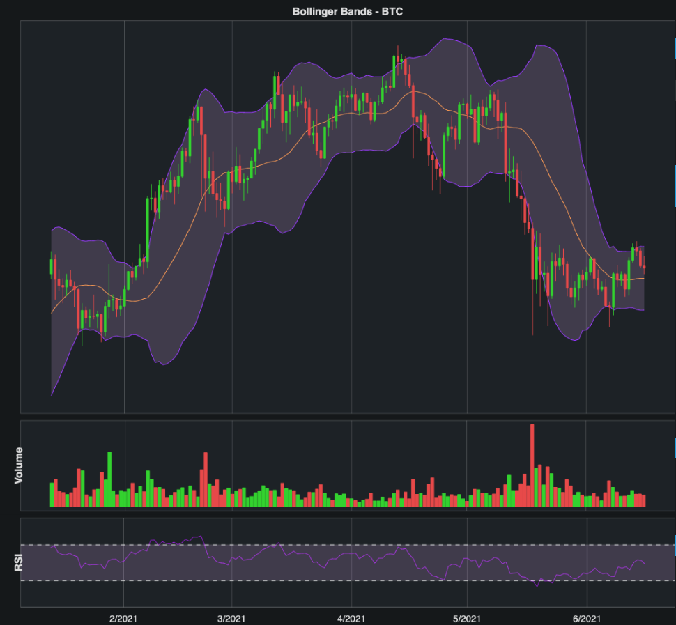
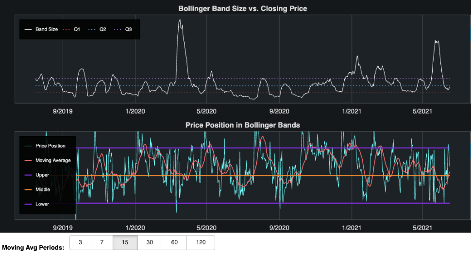
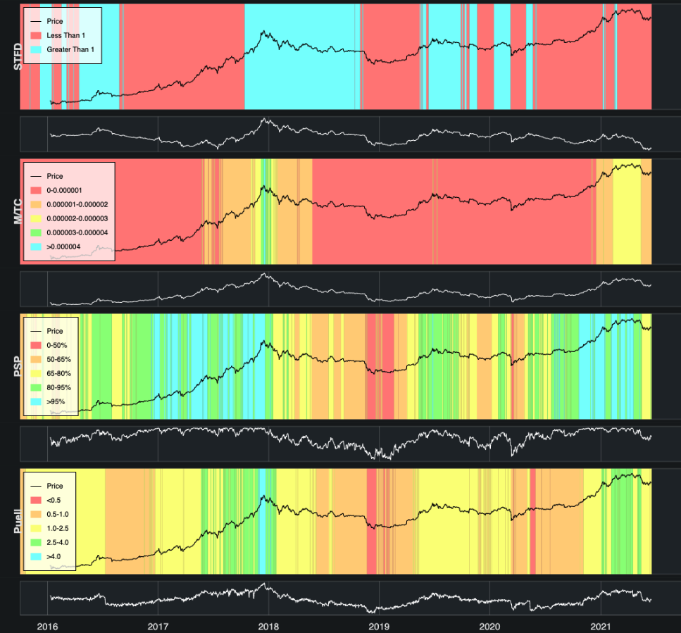
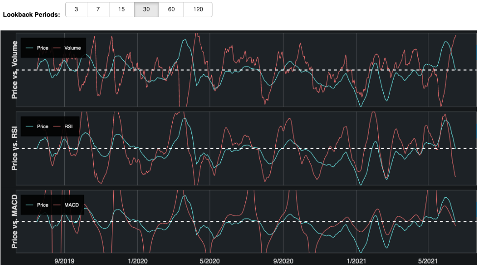
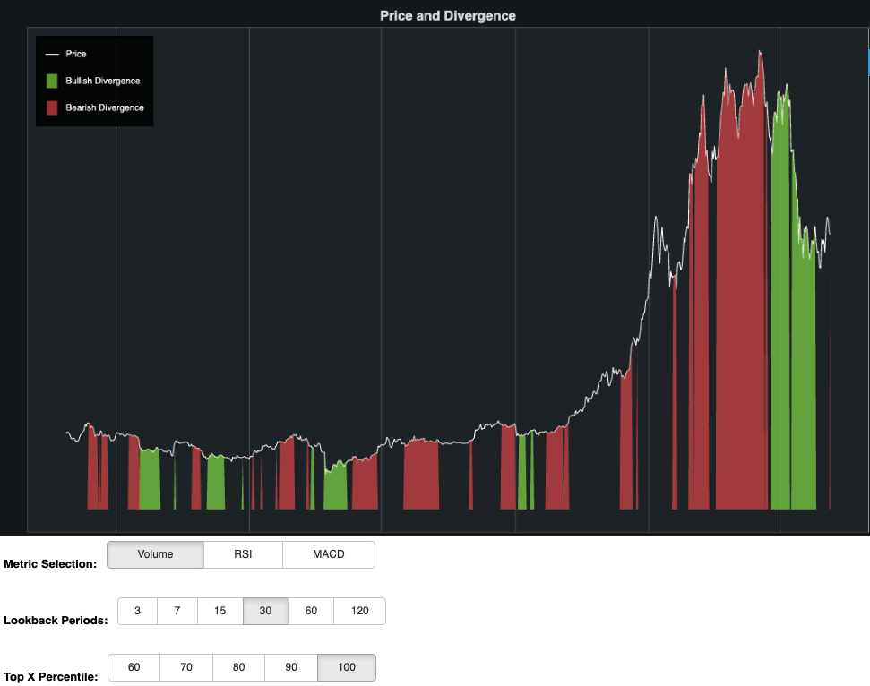

# Project Writeup - The State of Bitcoin

## Abstract

There are a wide variety of indicators in the world of trading that aim to describe what an asset is doing and provide clues to how the price of that asset might change in the future. The aim of this project was to pull price data and other information and create a data pipeline that would ultimately produce an automated dashboard that could be viewed on a daily basis to quickly review the state of Bitcoin. I used jesse.trade (an algorithmic trading AI) to pull candle data (open, close, high, low, and volume) and the Glassnode API to pull metrics related to "on-chain activity." This includes metrics like transactions, transaction fees, addresses, percent of supply in profit, and many others that are not calculated purely using historical prices. This data was manipulated to generate both popular and novel trading indicators, which were neatly organized on a Bokeh dashboard. I also built and deployed a Random Forest classification model predicting whether price would rise or fall in the next week based on the data currently available.

## Design

This project was all about pipeline design, how to efficiently create a product or service from raw data. The dashboard I created was designed to run on daily data, meaning that it uses the daily price candle for a given day (4PM to 4PM PST). The pipeline is modularized to silo data collection, data manipulation, data storage, and presentation. The final pipeline has 3 major steps:

1. Each morning (or at any other point throughout the day), the first step in the process is to run a candle data import using jesse.trade through the terminal. This will download all price data for any days not yet captured and store it in the database.
2. After price data is stored, a python script is run. This script combines several modules:
    - Glassnode data collection and storage using the Glassnode API.
    - Reddit comment collection and storage for new daily discussion threads in r/Bitcoin using PRAW (data not yet implemented on the dashboard).
    - Google Trends data collection and storage through pytrends (data not yet implemented on the dashboard).
    - Price indicator calculation and storage. Price indicators are calculated primarily using the jesse.trade indicator package, but certain indicators are novel in nature and calculated using self-built fuctions stored in separate modules.
3. Once indicators are calculated and all data is stored, a third command is given to launch the Bokeh dashboard.

## Data

When importing the bitcoin price data, jesse.trade provides data down to the hourly level, which is being stored in the Postgres database. Fortunately, the jesse.trade tool also has built-in functionality for returning daily candles (opening price, closing price, high price, low price, and trading volume). 

The bigger challenge with this problem is not in scale, but rather in the complexity, although scale can become a concern as the number of indicators grows. For each and every indicator, a new day-by-day time-series needed to be calculated and stored. In the final pipeline, this was accomplished in a python script that ran the collection and manipulation/storage modules back to back. In addition to the indicators used in building the time-series visualizations, I also needed to calculate and store interactions between indicators, as I also ran a Random Forest Classification model that aims to predict whether the price of Bitcoin will be higher or lower one week from the prediction.

The dashboards include all price data from January 2016 through today's date. Approximately 6 months from 2015 are also included but cannot be displayed because certain indicators require X number of past periods to be calculated.

## Algorithms

- Modularization
    - The code for my project is broken out into clear modules that each handle specific parts of the pipeline process. This allows for simpler maintenance and for the addition of new data sources and indicators in the future.

- Visualization
    - I built the Bokeh dashboard with the customer in mind. The dashboards are ordered and organized logically and include interactive elements and hover text that make for easier ingestion and exploration of the data

- Random Forest Classification
    - I implimented a Random Forest Classifier to predict whether prices would be higher or lower one week out. I used a series of sequential forward and sequential backward tests to reduce features and maximize the predictive ability of the model. This was not the primary focus of this project, and further tuning and validation is required.

## Tools

- Data Collection
    - jesse.trade - Candle data collected through API.
    - Glassnode API - On-chain metrics data collected through API.
    - PRAW - Collected Reddit post information and comments content through API.
    - PyTrends - Collected Google Trends data through API.
- Data Storage
    - PostgreSQL
    - SQL Alchemy
- Data Cleaning/Manipulation
    - jesse.trade - Indicators package.
    - Numpy
    - Pandas
    - Scipy - Regression slope calculations.
- Modeling
    - Sci-kit Learn - Random Forest Classifier, StandardScaler, train_test_split, confusion_matrix, etc.
- Presentation
    - Bokeh - Deployed web application with several visualizations.

## Communication

I delivered a PowerPoint presentation, during which I walked through my final product presented on a Bokeh dashboard. A series of screenshots from the dashboard are included below.

### One-Week Random Forest Price Prediction

### Ichimoku Cloud

### Bollinger Bands

### On-Chain Metrics

### Divergences

